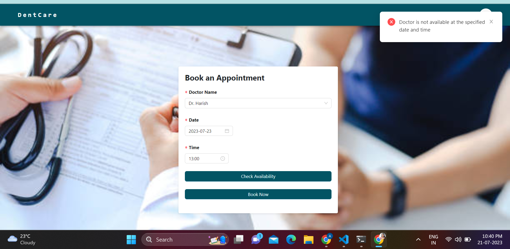

# <h1>DENTAL CLINIC APPLICATION</h1>

## Modules of the application
<li> Admin Module </li>
<li> User Module </li>

## Functionalities --->

### 1. Admin Module -
<li> <b>1. Manage Appointments-</b> The admin will be able to manage all the appointments of the users. Here the admin will be able to perform the following operations of cancel, pending or confirm status of the appointment. </li>
 

  

<li> <b>2. Add Doctors-</b> The admin will be able to add or onboard the doctors to the app.</li>
 

<li> <b>3. Manage Doctors-</b> In this functionality the admin will be able to manage all the doctors- the admin can see all the listed doctors to the clinic if he want then he can delete the doctors also.</li>
 

<li> <b>4. Manage Users-</b> In this functionality the admin will be able to see all the registered users.</li>
 

### 2. Users Module- 
<li> <b>1. Book Appointment-</b> The user can book an appointment by selecting the available doctor's name from the dropdown list, date and time of the appointment. Before booking the appointment they can check if the doctor is available or not. 
    - Dropdown List for the doctor's name in the book appointments model.
    - Check Availability - To check the availability of the doctors
</li>
 

<li> <b>2. View Appointments Status for the users -</b> In this, the users will be able to see all the appointments they have done and the status for them (Cancelled, Confirmed or Pending)  </li>

